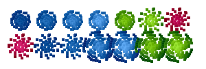
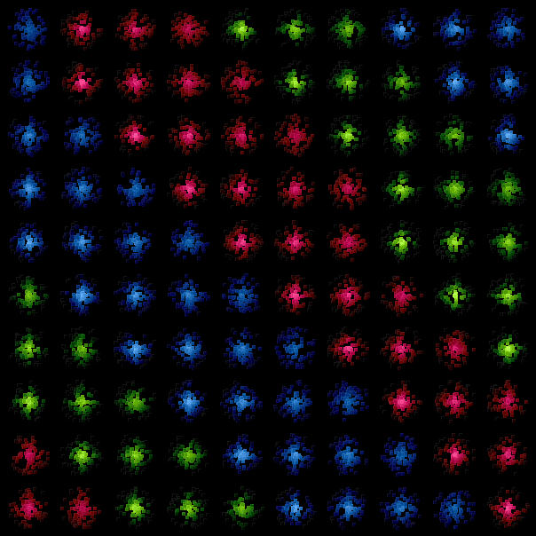

[](https://travis-ci.org/pontuslaestadius/pathtracer)
[](https://docs.rs/pathtracer/latest/pathtracer/)
[](https://github.com/pontuslaestadius/pathtracer/blob/master/LICENSE)

Previously named pathfinder, but that name was requested and handed over to the servo/pathfinder project.


> Graph large number of Connected Nodes mapped on to an Image or Gif.


The Logo is generated using the library, the implementation can be found in the examples directory.

Placing positioned objects on to an Image can cause many issue. This library is meant to ease interacting with images and create higher order abstractions which makes it easy to populate larger Image surfaces with large number of surface objects.


### Features

* [Connecting Nodes](https://github.com/pontuslaestadius/pathtracer/blob/master/examples/hello_world.rs)
* [Traversing paths](https://github.com/pontuslaestadius/pathtracer/blob/master/examples/mvp.rs)
* [Data visualisation](https://github.com/pontuslaestadius/pathtracer/blob/master/examples/git_log.rs)
* [Large number of Nodes](https://github.com/pontuslaestadius/pathtracer/blob/master/examples/random.rs)
* [Plot large number of Nodes](https://github.com/pontuslaestadius/pathtracer/blob/master/examples/node_plot.rs)
* [Gifs](https://github.com/pontuslaestadius/pathtracer/blob/master/examples/hello_world_gif.rs)
* [Invocation macros for structures](https://docs.rs/pathtracer/latest/pathtracer/#macros)


## Example

Place greater number of Nodes using Groups. A Group is structure which encapsulates many Nodes.

```rust
use pathtracer::{Group, map};
use std::path::Path;

let mut groups = Group::from_list(&[(0, 0), (100, 100)]);
for group in groups.iter_mut() {
    group.add(100);
}
Map::new()
    .map(&groups)
    .save(&Path::new("out.png"));
```

Path through a list of connected nodes.
Generate a list of generic nodes, that are then linked in indexed order, then we create a network out of the Nodes, and confirm that the first node is connected to the last.

```rust
let pos = [(0, 0), (100, 100), (150, 50), (2000, 4000), (400, 600)];
let nodes = Node::from_list(&pos); // Generic Nodes are named in sequence: A-Z.
let nodes = Node::linked_list(nodes);
let net = Network::new(nodes);
let path = net.path("A", "E");
node::path_print(&path?);
```


### Output

These examples are generated from examples located in the repository.





